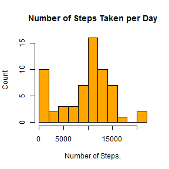
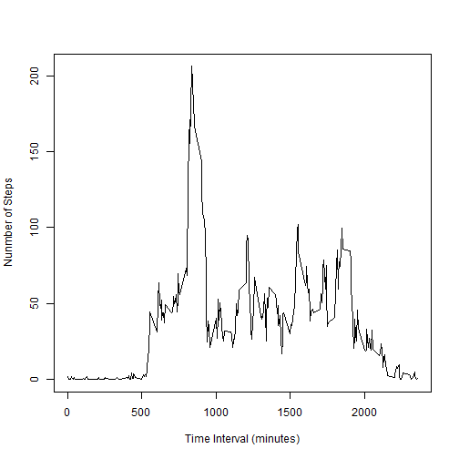
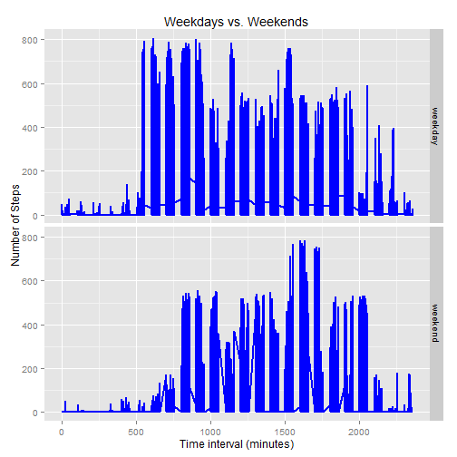

###Introduction
This report describes data analysis of the file "activity.csv", which contains data on the number of steps taken by a person based on data from a personal monitoring device. The number of steps was recorded in 5-minute intervals over a period of 2 months in October and November 2012.

###Loading the Data
First, the data are loaded using read.csv(), assuming that the data file is present in the working directory:


```r
edata <- read.csv("activity.csv")
head(edata)
```

```
##   steps       date interval
## 1    NA 2012-10-01        0
## 2    NA 2012-10-01        5
## 3    NA 2012-10-01       10
## 4    NA 2012-10-01       15
## 5    NA 2012-10-01       20
## 6    NA 2012-10-01       25
```

The data has three fields: number of steps "steps", the date of the data "date", and the 5-minute interval during the day "interval".  

###Steps Per Day
The total number of steps taken each day can be determined with a call to tapply():


```r
# Create a vector that stores the total number of steps taken each day:
byday <- tapply(edata$steps, edata$date, sum, na.rm=TRUE)
# Display histogram:
hist(byday, main="Number of Steps Taken per Day", xlab="Number of Steps,", ylab="Count", col="orange", breaks=10)
```

 

As can be seen, there is substantial variation in the daily totals for number of steps.
Mean and median can be calculated from the tapply() results:


```r
print(paste("Mean steps per day:" , format(mean(byday, na.rm=TRUE),nsmall=2)))
```

```
## [1] "Mean steps per day: 9354.23"
```

```r
print(paste("Median steps per day:", median(byday, na.rm=TRUE)))
```

```
## [1] "Median steps per day: 10395"
```

###Daily Activity Patterns
To see the pattern of steps in an "average" day, it is necessary to average each time interval across all of the days in the dataset.  The number of steps as a function of time interval is shown below:
    

```r
avgsteps <- tapply(edata$steps, edata$interval, mean, na.rm=TRUE)
intlist <- unique(edata$interval)
plot(intlist, avgsteps, type="l", xlab="Time Interval (minutes)", ylab="Nunmber of Steps")
```

 

The time interval with the greatest average number of steps is simply the maximum on this graph.


```r
print(paste("Interval with highest avg. # of steps:", intlist[avgsteps==max(avgsteps)],"minutes" ))
```

```
## [1] "Interval with highest avg. # of steps: 835 minutes"
```

###Imputing missing values
The original dataset contains a large number of NA values in the "steps" field, indicating that there are many time intervals where no data on steps is available.


```r
nalist <- is.na(edata$steps)
print(paste("Number of rows containing NA:",sum(nalist)  ))
```

```
## [1] "Number of rows containing NA: 2304"
```

These data were imputed by setting each NA equal to to the average number of steps for that time interval (across the entire 2-month dataset).  So, for example, if on a particular day there is no "steps" data available for the time interval starting at 125 minutes, the NA is replaced with the AVERAGE number of steps taken for the 125-minute interval across all days.  This imputed data was saved as "edata2".


```r
# Fill in each NA with average for that time interval from the dataset:
edata2 <- edata
for (i in 1:length(edata2$steps)) {
     if (is.na(edata2$steps[i]) ) {
          edata2$steps[i] <- avgsteps[as.numeric(names(avgsteps))==edata2$interval[i]]
     }
}
```

The revised histogram with the imputed values is displayed using:


```r
byday2 <- tapply(edata2$steps, edata2$date, sum, na.rm=TRUE)
hist(byday2, main="Number of Steps Taken per Day", xlab="Number of Steps,", ylab="Count", col="orange", breaks=10)
```

 

As before, the mean and median steps per day can be calculated:


```r
print(paste("IMPUTED DATA - Mean steps per day:" , format(mean(byday2, na.rm=TRUE),nsmall=2)))
```

```
## [1] "IMPUTED DATA - Mean steps per day: 10766.19"
```

```r
print(paste("IMPUTED DATA - Median steps per day:", median(byday2, na.rm=TRUE)))
```

```
## [1] "IMPUTED DATA - Median steps per day: 10766.1886792453"
```

The mean and median are altered appreciably by the imputation:

```r
mean(byday2) - mean(byday)
```

```
## [1] 1411.959
```


```r
median(byday2) - median(byday)
```

```
## [1] 371.1887
```

The mean goes up substantially, and the median rises somewhat as well.

###Investigating Weekdays vs. Weekends
Since the dataset includes both weekdays and weekends, additional analysis was conducted to see if there were differences in activity between the two.
A new field, 'daytype', was added to the imputed dataset to classify collected data as pertaining to a weekday or weekend.


```r
edata2$daytype = rep("weekday",length(edata2$steps))
edata2$daytype[weekdays(as.Date(edata2$date))=="Saturday"] <- "weekend"
edata2$daytype[weekdays(as.Date(edata2$date))=="Sunday"] <- "weekend"
edata2$daytype <- as.factor(edata2$daytype)
     
savgs <- tapply(edata2$steps, list(edata2$interval, edata2$daytype), mean)
z <- as.data.frame(savgs)
```


```r
library(ggplot2)
g <- ggplot(edata2, aes(x=interval, y=steps))
g <- g + geom_line(color="blue", size = 1) + facet_grid(daytype ~ .)
g <- g + xlab("Time interval (minutes)") + ylab("Number of Steps")  
g <- g + labs(title= "Weekdays vs. Weekends")
g
```

 

